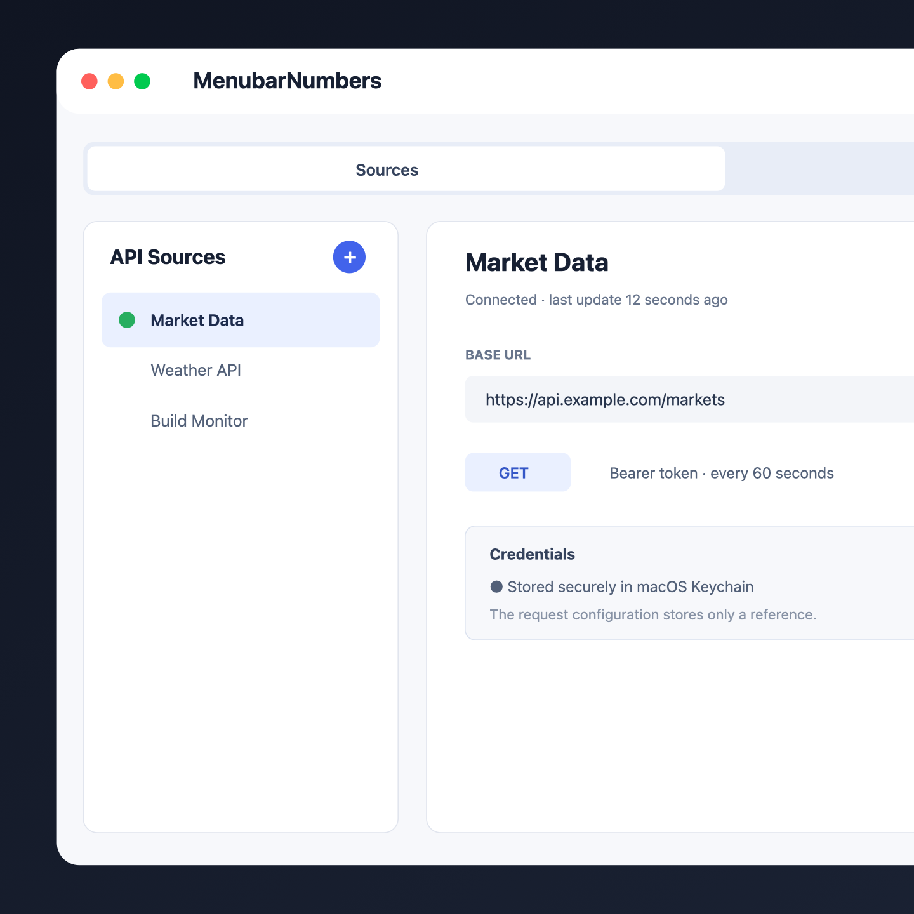
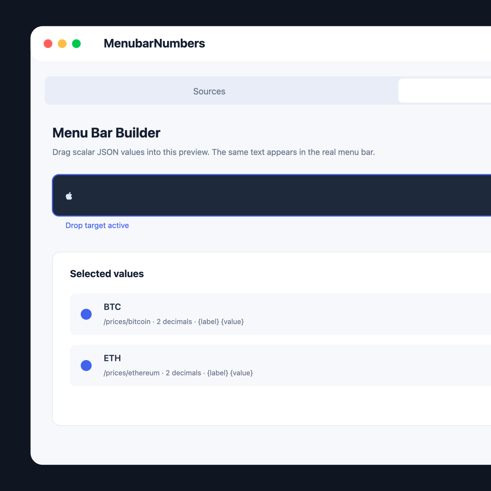
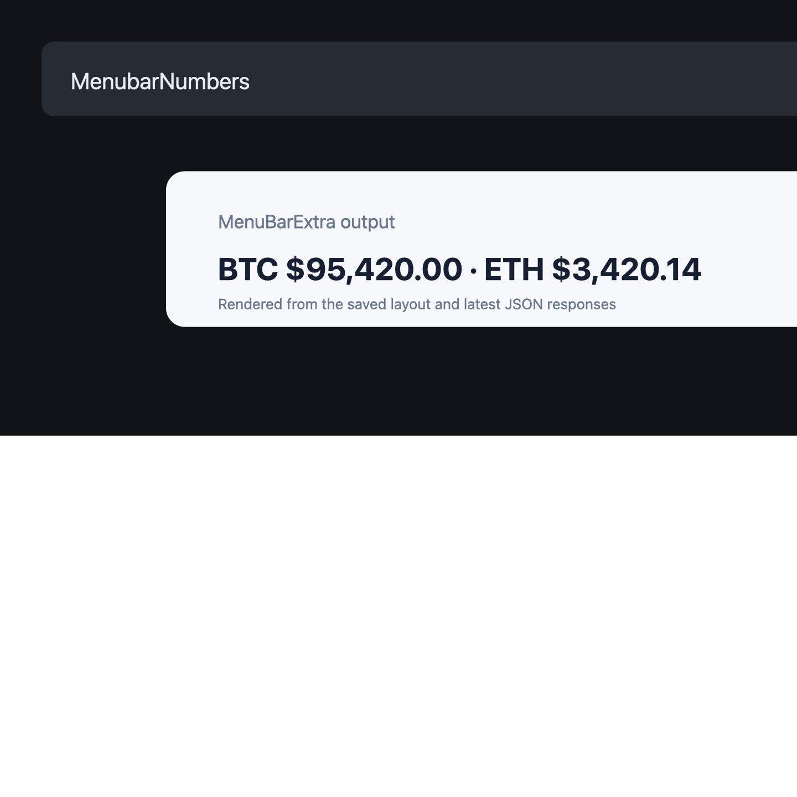

# MenubarNumbers

MenubarNumbers is a native macOS menu-bar dashboard for live values from one or more REST/JSON APIs. Connect an endpoint, keep its request values in Keychain, test the response, then drag the scalar values you care about into a simulated menu bar.



## What it does

- Stores multiple GET/POST REST/JSON sources locally.
- Keeps authentication, headers, query values, and request bodies in macOS Keychain; persisted configuration contains only UUID references.
- Supports bearer, Basic, API-key header, and API-key query authentication.
- Inspects JSON responses through RFC 6901 JSON Pointers.
- Lets you drag scalar values into a simulated menu bar and reorder them.
- Formats numbers and dates, sets labels/templates/fallbacks, and uses the same renderer for the preview and `MenuBarExtra`.
- Polls only enabled sources that are used by the current layout, with coalesced refreshes and no overlapping requests.





## Requirements

- macOS 14 or newer
- Xcode with Swift 6 support
- An HTTPS API, or HTTP on localhost/loopback for local development

## Run locally

```bash
xcodebuild -project MenubarNumbers.xcodeproj \
  -scheme MenubarNumbers \
  -destination 'platform=macOS' \
  CODE_SIGNING_ALLOWED=NO \
  build
```

Open `MenubarNumbers.xcodeproj` in Xcode to run the app normally. The app stays active after its settings window is closed and exposes the combined live value through the macOS menu bar.

Run the complete test suite with:

```bash
xcodebuild test \
  -project MenubarNumbers.xcodeproj \
  -scheme MenubarNumbers \
  -destination 'platform=macOS' \
  CODE_SIGNING_ALLOWED=NO
```

## Configuration flow

1. Add an API source and enter its base URL, method, interval, auth, headers, query parameters, and optional JSON body.
2. Save and test the source. The response is shown as a navigable JSON tree.
3. Drag a scalar node, or use its **Add to Menu Bar** action, in the Menu Bar workspace.
4. Set its label, template, fallback, numeric precision, or date style.
5. The simulated preview and the real menu-bar item update from the same layout and formatter.

## Security model

Configuration is stored locally as JSON metadata. Secret and request values are written to Keychain and referenced by UUID; they are resolved only while constructing a request. Errors and status messages are sanitized so response bodies and credentials are not shown. A 2 MiB response limit, HTTPS policy, and cancellation-aware refresh gate protect the live polling path.

## Release flow

`dev` is the integration branch. Changes are merged from `dev` into `main`; every push to `main` runs [`.github/workflows/release.yml`](.github/workflows/release.yml), runs the tests, builds an unsigned macOS app, publishes a DMG, and creates a GitHub release with generated notes.

```bash
git switch dev
git push origin dev

# after review/merge to main
git push origin main
```

The release artifact is a drag-to-Applications DMG and is intentionally unsigned. Add Apple Developer signing/notarization credentials to the workflow before distributing it outside a development environment.

## Architecture

- `MenubarNumbersCore`: Codable configuration, Keychain access, JSON Pointer traversal, API client, formatting, and polling coordination.
- `MenubarNumbers`: SwiftUI settings/source editor, JSON inspector, drag-and-drop menu-bar builder, persistence, and `MenuBarExtra`.
- `MenubarNumbersCoreTests`: 48 unit tests covering request construction, auth, error safety, JSON selection, formatting, persistence boundaries, polling, and cancellation races.

## License

No license has been selected yet.
